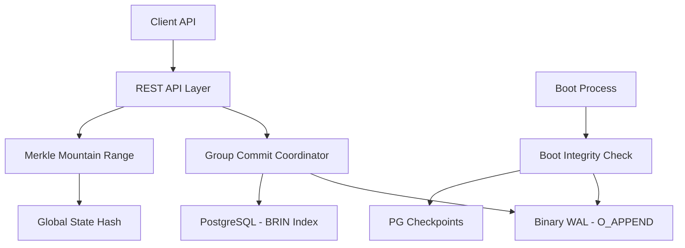

# 🥑 avocato-db

[](https://golang.org/)
[](https://www.docker.com/)
[](LICENSE)

**avocato-db** é um motor de banco de dados imutável, leve e focado estritamente em operações append-only protegidas por hashes criptográficos. Ele opera de forma totalmente isolada em containers Docker, priorizando determinismo de dados e integridade absoluta.

---

## 🏗️ Arquitetura

O avocato-db utiliza uma abordagem de **Armazenamento Híbrido** para balancear performance de escrita e flexibilidade de consulta.



### Componentes Core
- **Group Commit**: Agrupa múltiplas requisições de escrita para realizar um único `fsync`, garantindo performance $O(1)$ mesmo sob alta carga.
- **Merkle Mountain Range (MMR)**: Estrutura de dados que permite verificar a integridade da cadeia de blocos de forma eficiente e gerar provas de inclusão.
- **Boot Integrity Check**: A cada inicialização, o motor valida criptograficamente todo o histórico do Ledger antes de liberar a API.

---

## 🚀 Como Rodar

### Pré-requisitos
- Docker & Docker Compose

### Passo a Passo

1. **Clone o repositório**:
   ```bash
   git clone https://github.com/Kaiofprates/avocato-db.git
   cd avocato-db
   ```

2. **Suba o ambiente**:
   ```bash
   docker-compose up -d
   ```

3. **Verifique os logs de integridade**:
   ```bash
   docker-compose logs -f backend
   ```
   Você deverá ver a mensagem: `[avocato-db] Boot Integrity Check PASSED`.

4. **Acesse o Swagger UI**:
   Abra no seu navegador: [http://localhost:8080/swagger/index.html](http://localhost:8080/swagger/index.html)

---

## 🛠️ Exemplos de Uso (CURL)

### 1. Adicionar um Registro (Append)
O payload deve ser um JSON válido. Ele será serializado de forma determinística (RFC 8785) antes de ser hashado.

```bash
curl -X POST http://localhost:8080/v1/append \
     -H "Content-Type: application/json" \
     -d '{"payload": {"sensor": "T01", "value": 25.5, "status": "active"}}'
```

### 2. Verificar Status de Integridade
Retorna a raiz atual do MMR e o total de blocos verificados.

```bash
curl http://localhost:8080/v1/integrity
```

### 3. Recuperar um Bloco por Índice
```bash
curl http://localhost:8080/v1/block/1
```

### 4. Recuperar um Bloco por Hash
```bash
curl http://localhost:8080/v1/block/<hash_hexadecimal>
```

---

## ⚖️ Constituição do Projeto

O avocato-db é regido pela [avocato-db Constitution v1.1.0](.specify/memory/constitution.md). Algumas regras invioláveis:
- **Sem DELETE/UPDATE**: O motor não possui código para modificar dados persistidos.
- **Chain Coupling**: Cada bloco contém o hash do bloco anterior.
- **Boot Scan**: O motor recusa-se a iniciar se detectar qualquer alteração não autorizada no disco.

---

## 🛠️ Tech Stack
- **Linguagem**: Go 1.22+
- **Banco de Dados**: PostgreSQL 16 (Secondary storage & indexing)
- **Hashing**: SHA-256
- **Integridade**: Merkle Mountain Range (MMR)
- **Infra**: Docker & Docker Compose

---

## 📝 Licença
Distribuído sob a licença Apache 2.0. Veja `LICENSE` para mais informações.
